# Focus Buddy Architecture Documentation

This document provides visual diagrams of the Focus Buddy agent system architecture and workflow.

---

## 1. System Mindmap

High-level overview of all components:

---

## 2. Agent Workflow

Complete flow from user input to completion:

---

## 3. Technical Architecture

Component-level system design:

```mermaid
graph TB
    subgraph User_Layer[" 👤 User Interaction Layer "]
        User[User Input:<br/>Tasks + Context]
        Display[Response Display:<br/>Plan + Checklist]
    end
    
    subgraph Agent_Layer[" 🤖 Multi-Agent System "]
        Orchestrator[Orchestrator<br/>Claude Sonnet 4]
        
        subgraph Roles[" Agent Roles "]
            Planner[🎯 Planner Role:<br/>Task Analysis<br/>Prioritization<br/>Scheduling]
            Coach[💪 Coach Role:<br/>Plan Presentation<br/>Motivation<br/>Check-ins]
        end
    end
    
    subgraph Tool_Layer[" 🔧 Tool Execution Layer "]
        ParseTool[parse_tasks<br/>━━━━━━━━<br/>Regex parsing<br/>Extract time/deadlines<br/>Normalize format]
        
        PriorityTool[prioritize_tasks<br/>━━━━━━━━<br/>Score calculation<br/>Urgency detection<br/>Sort by priority]
        
        ScheduleTool[create_focus_schedule<br/>━━━━━━━━<br/>Time fitting<br/>Block creation<br/>Buffer management]
    end
    
    subgraph Memory_Layer[" 💾 Session State "]
        TaskList[(Task List)]
        CurrentPlan[(Current Plan)]
        CompletionLog[(Completion Log)]
    end
    
    subgraph Data_Models[" 📋 Data Structures "]
        TaskModel[Task Object:<br/>- title<br/>- estimated_minutes<br/>- deadline<br/>- priority_score]
        
        ScheduleModel[ScheduledBlock:<br/>- start_minute<br/>- end_minute<br/>- task_title]
    end
    
    User -->|Raw text| Orchestrator
    Orchestrator -->|System prompt| Planner
    Orchestrator -->|System prompt| Coach
    
    Planner -->|Tool call| ParseTool
    ParseTool -->|Task objects| TaskModel
    TaskModel -->|Store| TaskList
    
    Planner -->|Tool call| PriorityTool
    PriorityTool -->|Sorted tasks| TaskModel
    
    Planner -->|Tool call| ScheduleTool
    ScheduleTool -->|Schedule| ScheduleModel
    ScheduleModel -->|Store| CurrentPlan
    
    CurrentPlan -->|Retrieve| Coach
    Coach -->|Format response| Display
    Display -->|Show plan| User
    
    User -->|Completion report| Coach
    Coach -->|Update| CompletionLog
    CompletionLog -->|History| Orchestrator
    
    classDef userStyle fill:#E3F2FD,stroke:#1976D2,stroke-width:2px
    classDef agentStyle fill:#F3E5F5,stroke:#7B1FA2,stroke-width:2px
    classDef toolStyle fill:#FFF3E0,stroke:#F57C00,stroke-width:2px
    classDef memoryStyle fill:#E8F5E9,stroke:#388E3C,stroke-width:2px
    classDef dataStyle fill:#FFF,stroke:#666,stroke-width:1px,stroke-dasharray: 5 5
    
    class User,Display userStyle
    class Orchestrator,Planner,Coach agentStyle
    class ParseTool,PriorityTool,ScheduleTool toolStyle
    class TaskList,CurrentPlan,CompletionLog memoryStyle
    class TaskModel,ScheduleModel dataStyle
```

---

## 4. Tool Execution Sequence

Detailed sequence of tool calls for a sample session:

---

## Key Concepts Demonstrated

### 1. Multi-Agent System
- **Orchestrator**: Routes between Planner and Coach roles
- **Planner**: Analytical role - parsing, prioritizing, scheduling
- **Coach**: Interactive role - presenting, motivating, tracking

### 2. Tool Use (Function Calling)
- `parse_tasks`: Converts unstructured text → Task objects
- `prioritize_tasks`: Applies scoring logic → Sorted list
- `create_focus_schedule`: Fits tasks into time → Schedule blocks

### 3. Session Memory
- Stores current focus plan across tool calls
- Tracks completion status between check-ins
- Enables continuity for multi-sprint sessions

---

## Design Principles

1. **Realistic Planning**: Never schedule more than fits in available time
2. **Energy-Aware**: Adjusts task selection based on user energy level
3. **Quick Wins**: Prioritizes short, high-impact tasks for momentum
4. **Continuous Improvement**: Learns from completion patterns to suggest better plans