# Focus Buddy Architecture Documentation

Visual diagrams of the Focus Buddy agent system.

---

## 1. System Mindmap


---

## 2. Agent Workflow

```mermaid
flowchart TD
    Start([User Starts Session]) --> Input[User provides:<br/>- Messy task list<br/>- Time available<br/>- Energy level]
    
    Input --> Orchestrator{Orchestrator<br/>Agent}
    
    Orchestrator -->|Activate| Planner[Planner Agent Role]
    
    Planner --> Tool1[Tool: parse_tasks]
    Tool1 -->|Raw text| Parse[Parse & Structure]
    Parse -->|Task objects| Tool2[Tool: prioritize_tasks]
    
    Tool2 --> Priority[Calculate Priority Scores:<br/>- Urgency +3<br/>- Quick wins +2<br/>- Keywords +2<br/>- Time factor]
    Priority -->|Sorted tasks| Tool3[Tool: create_focus_schedule]
    
    Tool3 --> Schedule[Build Timeline:<br/>- Fit in time window<br/>- Max 3-5 tasks<br/>- Leave buffer]
    Schedule -->|Schedule blocks| Memory[(Session Memory)]
    
    Memory -->|Store plan| Coach[Coach Agent Role]
    
    Coach --> Present[Present Plan:<br/>✓ Summary<br/>✓ Timeline<br/>✓ Checklist<br/>✓ Check-in time]
    
    Present --> Confirm{User<br/>Confirms?}
    
    Confirm -->|Too heavy/light| Adjust[Adjust plan]
    Adjust --> Tool3
    
    Confirm -->|Approved| Execute[User Executes<br/>25-min Sprint]
    
    Execute --> Wait[⏰ Timer: 25 minutes]
    
    Wait --> Return[User Returns<br/>with Results]
    
    Return --> Coach2[Coach Agent:<br/>Check-in Phase]
    
    Coach2 --> Track[Track Completion:<br/>- Mark done/not done<br/>- Store outcomes<br/>- Suggest improvements]
    
    Track --> Memory
    
    Track --> Decide{Continue<br/>Session?}
    
    Decide -->|Yes, more tasks| Planner
    Decide -->|No| End([Session Complete])
    
    style Orchestrator fill:#4A90E2,stroke:#2E5C8A,color:#fff
    style Planner fill:#7B68EE,stroke:#5A4BC7,color:#fff
    style Coach fill:#50C878,stroke:#3A9B5C,color:#fff
    style Coach2 fill:#50C878,stroke:#3A9B5C,color:#fff
    style Memory fill:#FFB84D,stroke:#CC8F3D,color:#000
    style Tool1 fill:#E8E8E8,stroke:#999
    style Tool2 fill:#E8E8E8,stroke:#999
    style Tool3 fill:#E8E8E8,stroke:#999
```


---

## 3. Technical Architecture
```mermaid
graph TB
    subgraph User_Layer[" 👤 User Interaction Layer "]
        User[User Input:<br/>Tasks + Context]
        Display[Response Display:<br/>Plan + Checklist]
    end
    
    subgraph Agent_Layer[" 🤖 Multi-Agent System "]
        Orchestrator[Orchestrator<br/>Gemini 2.0 Flash]
        
        subgraph Roles[" Agent Roles "]
            Planner[🎯 Planner Role:<br/>Task Analysis<br/>Prioritization<br/>Scheduling]
            Coach[💪 Coach Role:<br/>Plan Presentation<br/>Motivation<br/>Check-ins]
        end
    end
    
    subgraph Tool_Layer[" 🔧 Tool Execution Layer "]
        ParseTool[parse_tasks<br/>━━━━━━━━<br/>Regex parsing<br/>Extract time/deadlines<br/>Normalize format]
        
        PriorityTool[prioritize_tasks<br/>━━━━━━━━<br/>Score calculation<br